# Accés xarxes públicas

## Configuracions inicials: IP dels dos Zorin i del IPFire

Farem servir tres màquines virtuals: dos Zorin OS i un IPFire. El primer Zorin OS serà el client, el segon serà el servidor i l'IPFire serà el router que connectarà les dues màquines a Internet. 

Un Zorin tindrà xarxa interna i l'altre xarxa NAT, l'IPFire tindrà una interfície de xarxa interna i una altra de xarxa NAT.

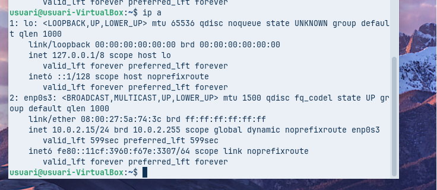

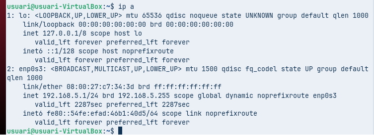

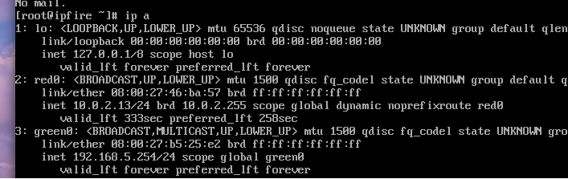

Després haurem de instal·lar els serveis de ssh i apache2 al servidor.

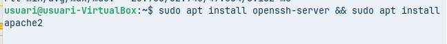

Comprovem que els serveis estan funcionant correctament:

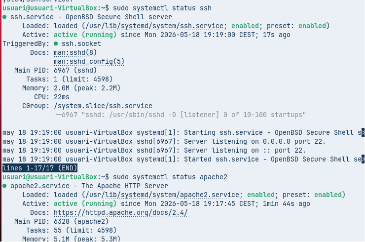

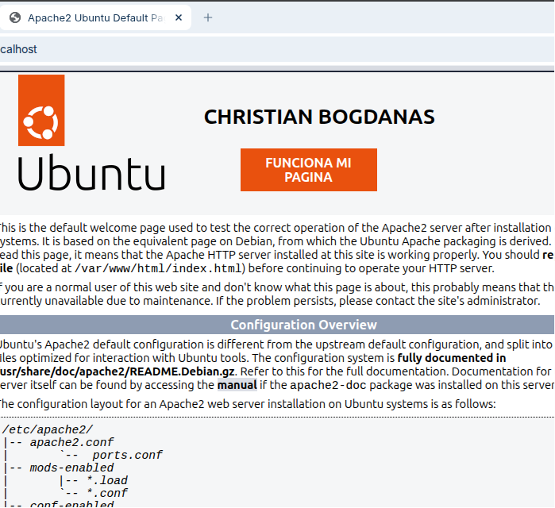

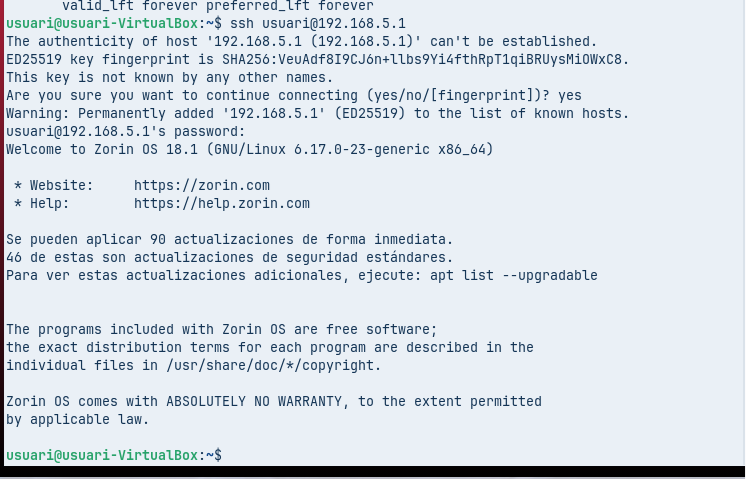

## Destination NAT

Configurar DNAT (port forwarding) al firewall. Amb aquesta tècnica, el firewall escolta en un port de la seva IP pública i, quan rep una connexió, la redirigeix transparentment cap al servidor intern. Per a qui es connecta des de fora, sembla que el servei estigui allotjat al propi firewall.

## Regla DNAT per al servei web 

A la interfície web d'IPFire, s'obre Cortafuegos → Reglas → Nueva regla i s'omple el formulari amb aquests valors:

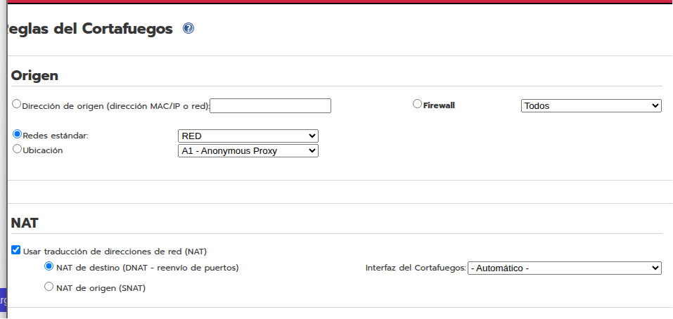

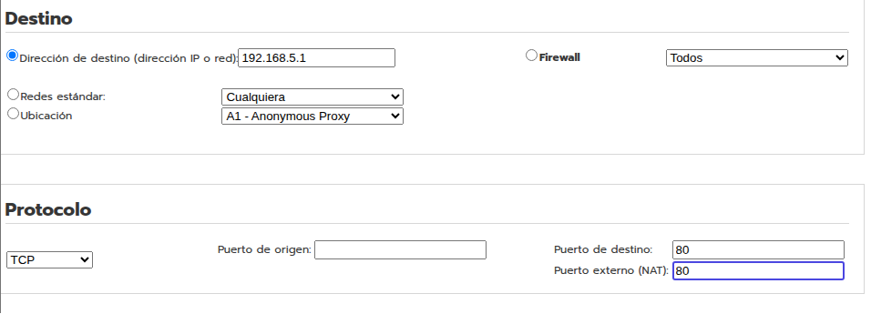

Un cop afegida i aplicada, la regla apareix a la llista del cortafoc. Des d'una màquina externa, s'obre el navegador apuntant a la IP pública del firewall (http://10.0.2.13) i la pàgina del servidor es carrega sense problemes.

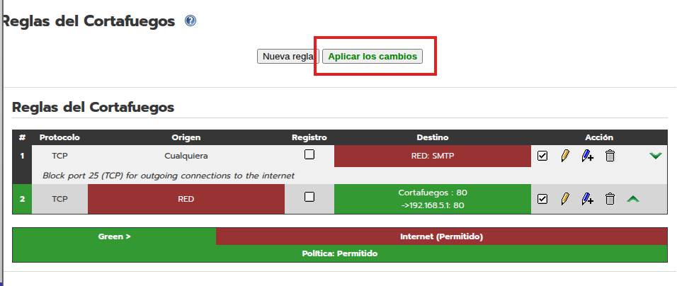

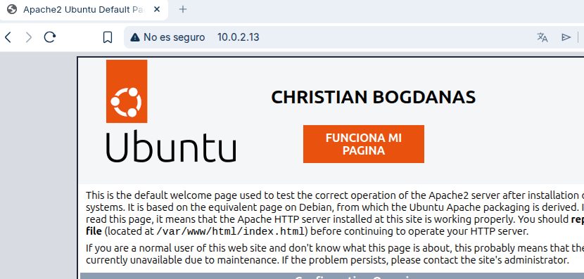

## Regla DNAT per a SSH 

El procediment és el mateix que per al web, amb una particularitat: en lloc d'exposar el port 22 directament, es fa servir el port 2222 com a port extern. 

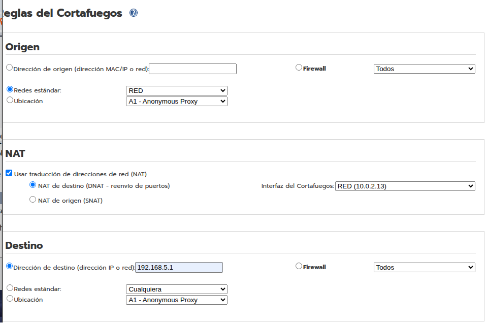

I afegim la regla al firewall.

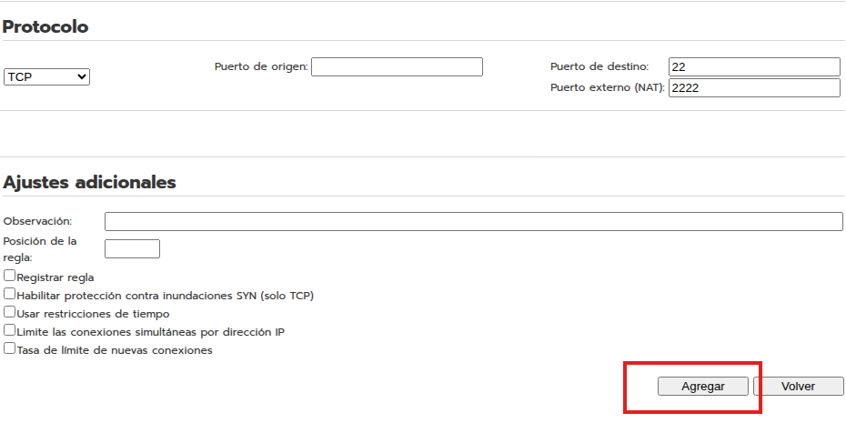

Quan un client extern es connecta al port 2222 del firewall, IPFire redirigeix la connexió al port 22 del servidor Zorin. La comprovació es fa des del PC extern.

```bash
ssh -p 2222 usuari@10.0.2.13
```

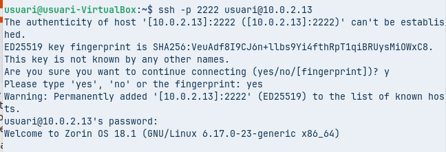

## Configuració de la VPN amb OpenVPN

El DNAT permet exposar serveis individuals, però no ofereix accés general a la xarxa interna. Per aconseguir-ho, s'utilitza una VPN. IPFire inclou OpenVPN integrat, la qual cosa simplifica el desplegament.

OpenVPN requereix tres tipus de certificats per funcionar de manera segura: Root CA: l'autoritat de certificació arrel, que signa la resta. Certificat de host: identifica el propi servidor IPFire. Certificat de client: un per cada usuari que es connecti a la VPN.

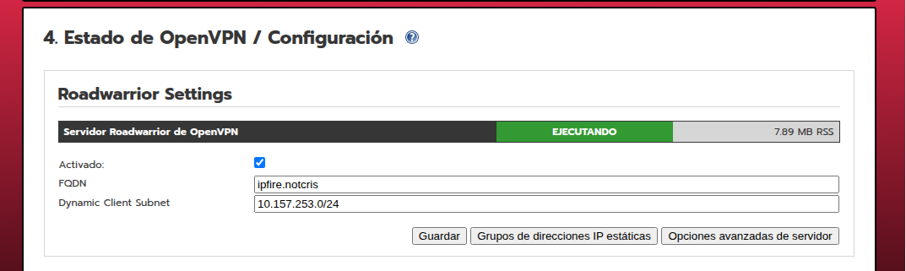

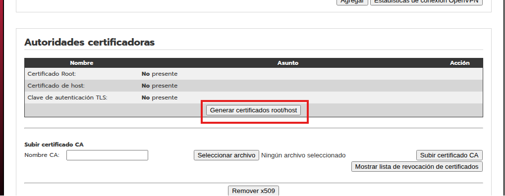

Des de la consola d'IPFire, s'accedeix a Servicios → OpenVPN → Generar certificados root/host.

Posem nom d'organització i host. I posem país Spain.

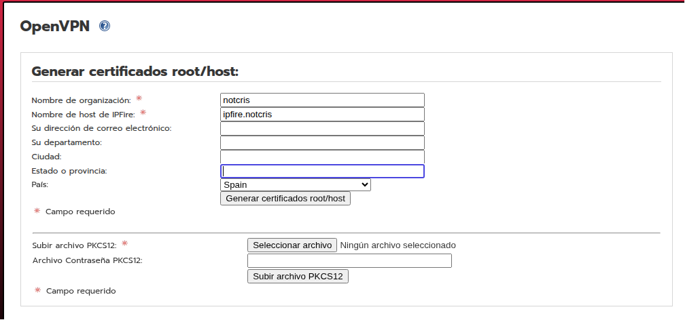

La generació de les claus triga uns instants. En acabar, apareixen a la llista de certificats: Root CA, certificat de host i la clau TLS estàtica de 2048 bits.

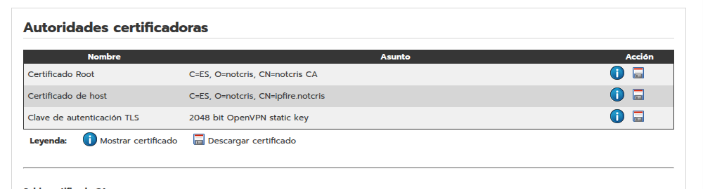

Un cop disposem dels certificats, es defineixen els paràmetres del servei OpenVPN:

- PORT: 1194 (UDP)
- Protocol: UDP
- algoritme de xifrat: SHA256
- dns: 192.168.4.254
- domain: notcris

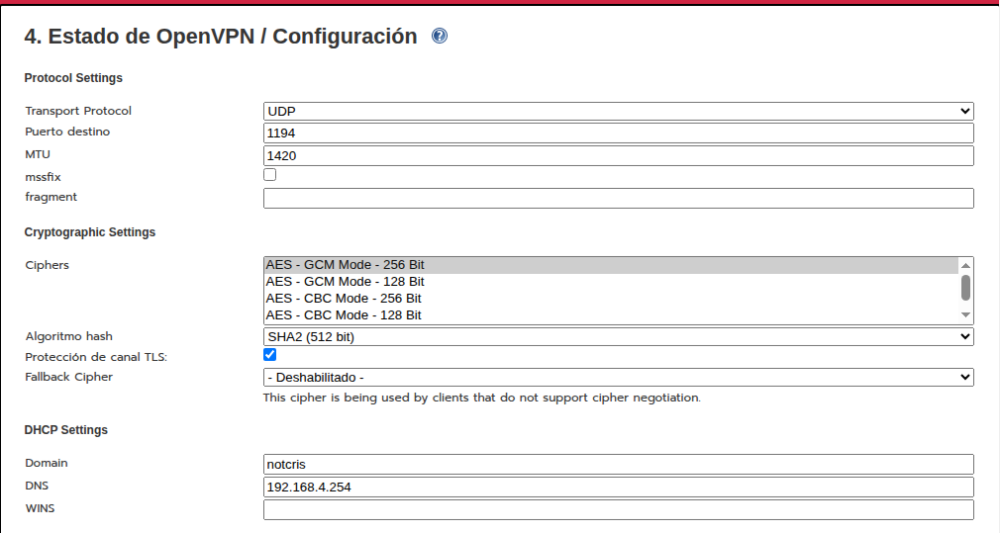

I guardem la configuració. 

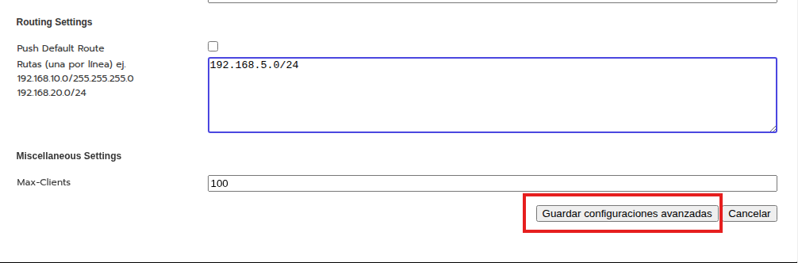

A la secció de connexions d'OpenVPN, es prem Agregar i es tria el tipus Host-to-Net (Roadwarrior), que és el model adequat quan un usuari es connecta des d'un lloc remot.

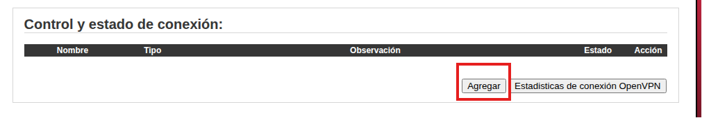

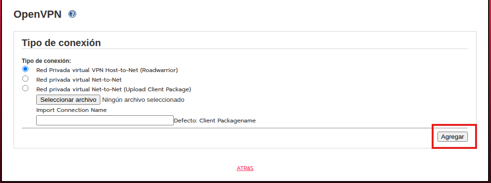

Posarem el nom de la connexió que serà notcris.

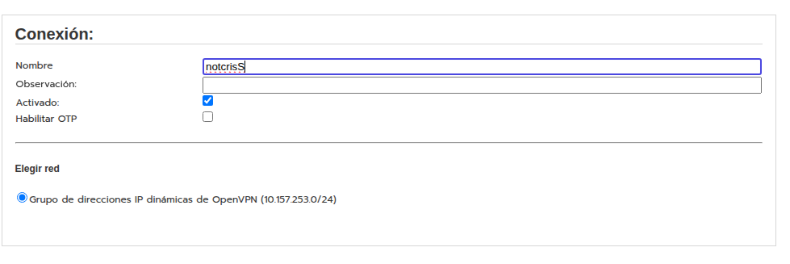

Posem aquests paràmetres:

- Nombre: client
- nom d'organització: notcris
- país: Spain
- contrasenya: 12345678

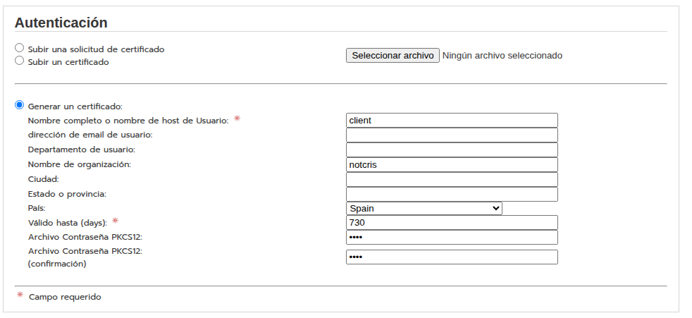

Haurem d'activar l'opció de Redirect Gateway perquè tot el tràfic del client passi per la VPN.

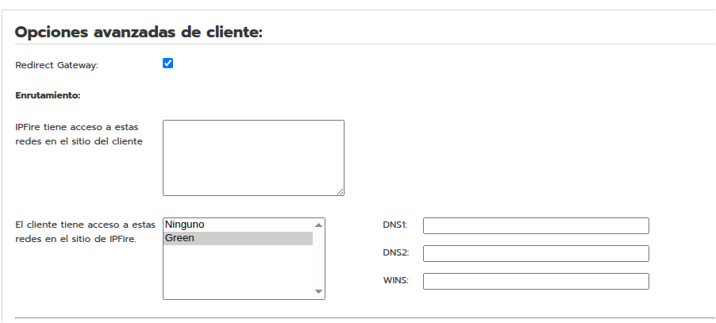

Un cop guardada la configuració, es descarrega el fitxer de configuració del client, que inclou els certificats i les claus necessàries per a establir la connexió VPN.

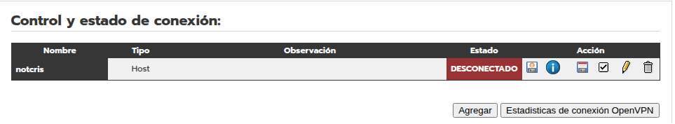

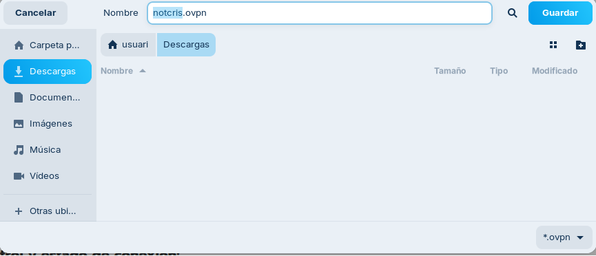

## Configuració del client Windows

És molt important que en el client Windows editem l'arxiu de hosts i afegim la IP del servidor amb el nom de domini que hem posat a la configuració d'OpenVPN. En aquest cas, afegirem la línia:

```bash
10.0.2.13 ipfire.notcris
```

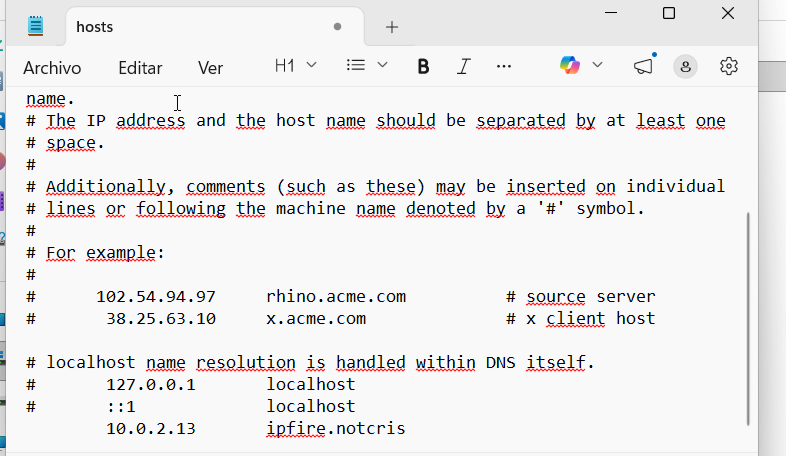

A continuació, es descarrega i s'instal·la el client OpenVPN per a Windows. Un cop instal·lat, es copia el fitxer de configuració del client (notcris.ovpn) i el fitxer de .p12. 

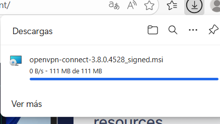

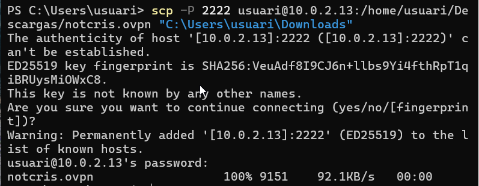

Després entrarem en l'aplicació d'OpenVPN i importarem el fitxer de configuració del client.

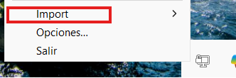

Després haurem de copiar els fitxers i moure'ls a la carpeta de configuració del client d'OpenVPN, que normalment es troba a C:\Program Files\OpenVPN\config.

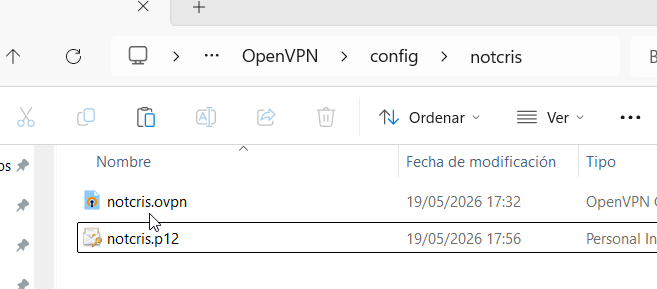

Haurem de posar la contrasenya que hem fixat a la configuració del client d'OpenVPN.

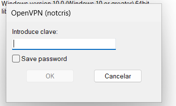

Aquí podem veure que la connexió s'ha establert correctament i que el client ha rebut una IP de la subxarxa VPN (10.157.253.2).

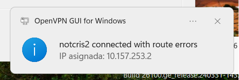

Podem veure en el panell que el client està connectat i que la connexió està activa.

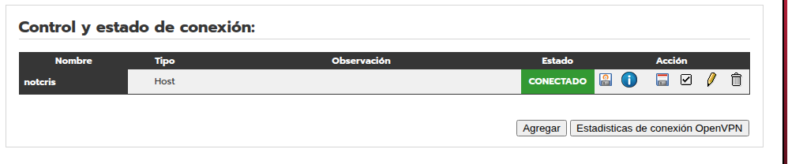

## Comprovacions finals

La prova definitiva consisteix a accedir als serveis del servidor intern usant directament la seva IP privada, sense dependre del DNAT. Amb la VPN activa, s'obre el navegador i s'accedeix. 

Podrem veure que pot fer ssh al servidor Zorin usant la IP privada, sense necessitat de passar pel port forwarding del firewall.

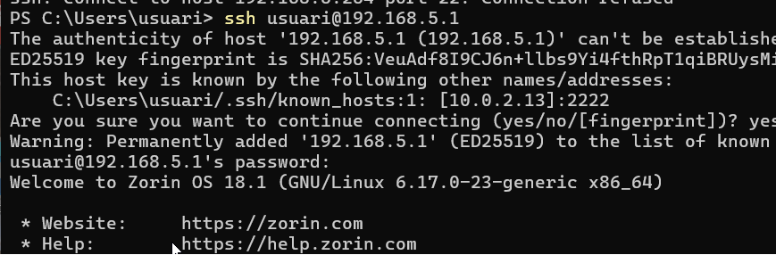

La pàgina del servidor web es carrega correctament. El client Windows opera com si estigués físicament dins de la xarxa 192.168.5.0/24.

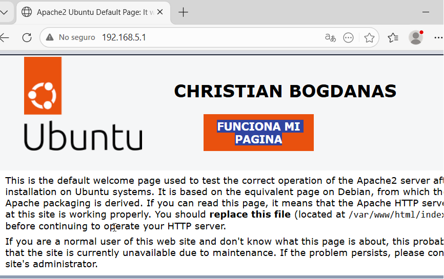

DNAT: obre un únic port cap a un servei específic. Útil per exposar serveis concrets de manera controlada. 

VPN: proporciona accés complet a tota la xarxa interna, amb tot el tràfic xifrat de cap a cap. Ideal per a treballadors remots o administradors de sistemes.


# Activitat extra

## Configura el servidor amb els paràmetres bàsics i genera l'arxiu que servirà per configurar el client

Anirem a serveis i després a WireGuard. Activarem el servei.

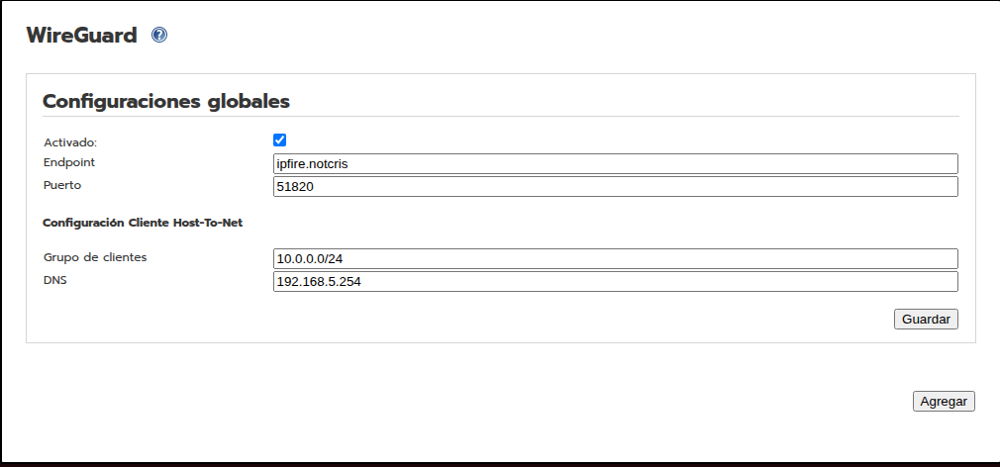

Posarem Red privada virtual i agregarem la configuració.

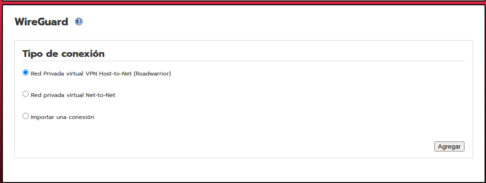

Després posarem com a nom usuari i com subxarxes permeses posarem totes 0.0.0.0/0.

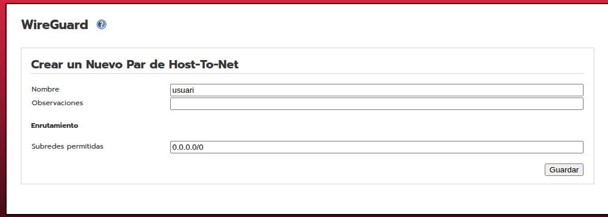

Aquí haurem de descarregar l'arxiu de configuració del client, que inclou les claus i els paràmetres necessaris per a establir la connexió VPN.

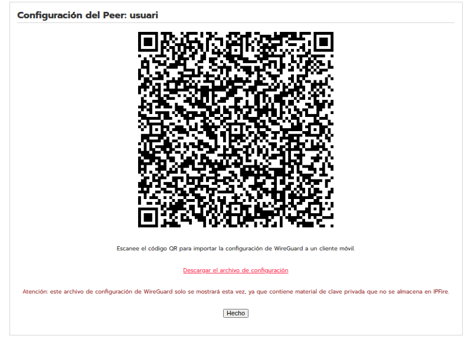

## Si uses un client Linux, no cal instal·lar cap eina, perquè les darreres versions ja tenen WireGuard incorporat al Kernel i per tant, es pot configurar directament des del Network Manager. Si uses Windows 11 sí que necessitaràs el client.

Descarreguem a la web oficial de WireGuard el client per a Windows i l'instal·lem.

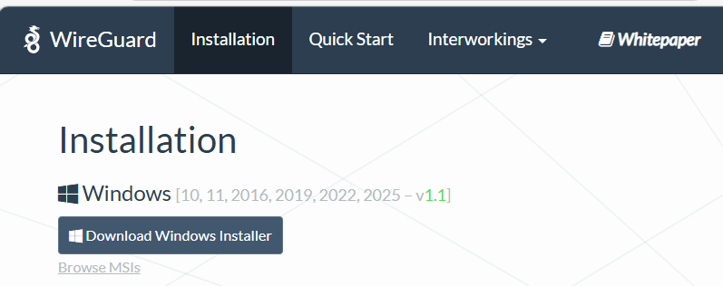

## Exporta l'arxiu de configuració cap la màquina que farà de client extern, de forma similar a com ho has fet amb OpenVPN.

En la terminal del client Windows, copiem el fitxer de configuració del client de WireGuard.

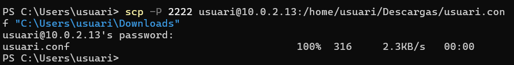

Aquí veiem que ja tenim tot instal·lat, haurem de importar l'arxiu pel túnel.

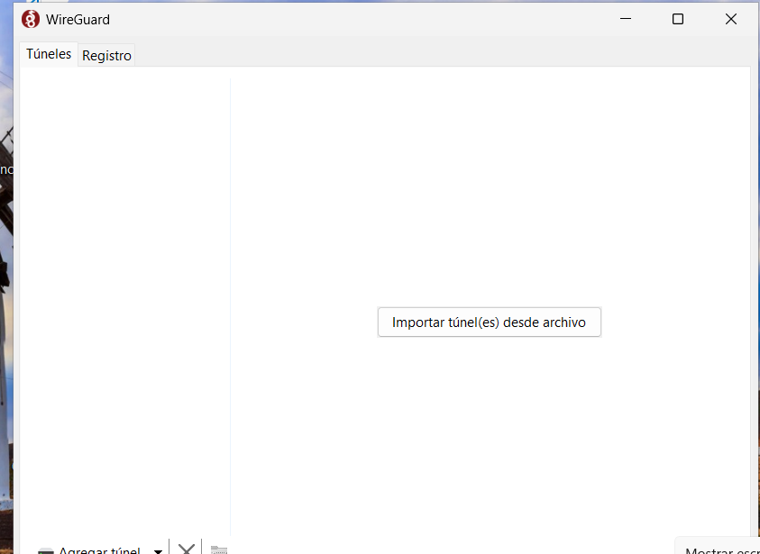

## Comprova la connexió.

Veurem que ja ho tenim activat. I tota la informació. 

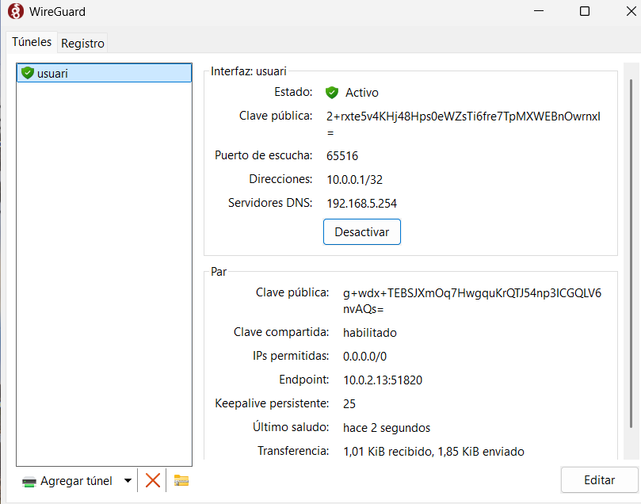

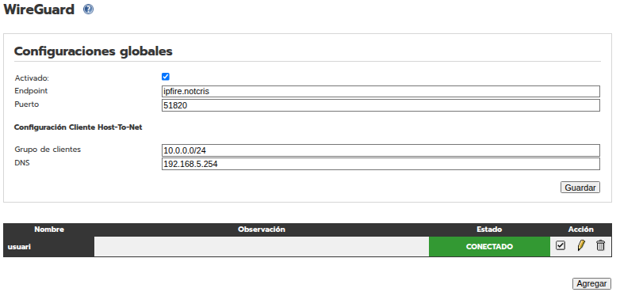

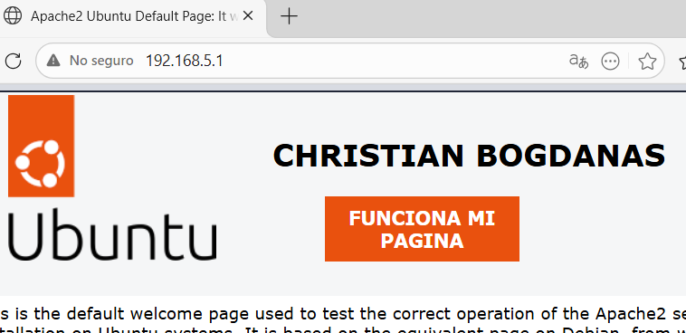


