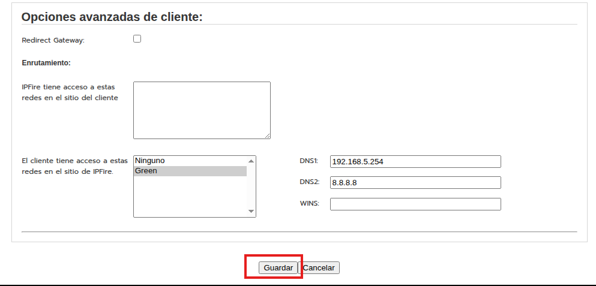

# Accés xarxes públicas

## Configuracions inicials: IP dels dos Zorin i del IPFire

Farem servir tres màquines virtuals: dos Zorin OS i un IPFire. El primer Zorin OS serà el client, el segon serà el servidor i l'IPFire serà el router que connectarà les dues màquines a Internet. 

Un zorin tindra xarxa interna i l'altre xarxa NAT, el ipFire tindra una interficie de xarxa interna i una altra de xarxa NAT.


Despres haurem de instalar els serveis de ssh i apache2 al servidor.


Comprovem que el serveis estan funcionant correctament:


## Destination NAT

Configurar DNAT (port forwarding) al firewall. Amb aquesta tècnica, el firewall escolta en un port de la seva IP pública i, quan rep una connexió, la redirigeix transparentment cap al servidor intern. Per a qui es connecta des de fora, sembla que el servei estigui allotjat al propi firewall.

## Regla DNAT per al servei web 

A la interfície web d'IPFire, s'obre Cortafuegos → Reglas → Nueva regla i s'omple el formulari amb aquests valors:


Un cop afegida i aplicada, la regla apareix a la llista del cortafocs. Des d'una màquina externa, s'obre el navegador apuntant a la IP pública del firewall (http://10.0.2.13) i la pàgina del servidor es carrega sense problemes.


## Regla DNAT per a SSH 

El procediment és el mateix que per al web, amb una particularitat: en lloc d'exposar el port 22 directament, es fa servir el port 2222 com a port extern. 


I agraguem la regla al firewall.


Quan un client extern es connecta al port 2222 del firewall, IPFire redirigeix la connexió al port 22 del servidor Zorin. La comprovació es fa des del PC extern.

```bash
ssh -p 2222 usuari@10.0.2.13
```

## Configuració de la VPN amb OpenVPN





